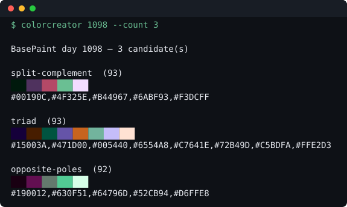

# ColorCreator

Deterministic BasePaint palette generator. Give it a day number, get palette
candidates you can propose as a theme.



```bash
npm install
npm run build
node dist/cli.js 1097
node dist/cli.js 1097 --count 3 --png day1097.png
```

Same day in, same palettes out — always. Each of eight strategies draws from a seed
derived from `hash(day, strategyId, attempt)`, so adding a strategy never changes
what the others produce.

To type `colorcreator` instead of `node dist/cli.js`:

```bash
npm link            # npm unlink -g colorcreator undoes it
colorcreator 1097
```

## Which day number?

BasePaint day 1 started at Unix time 1691599315 and each day is 86400 seconds, so:

```bash
node -e "console.log(Math.floor((Date.now()/1000 - 1691599315) / 86400) + 1)"
```

That prints the day being painted right now. You almost always want the **next**
one — a theme is proposed before its day opens:

```bash
node dist/cli.js $(node -e "console.log(Math.floor((Date.now()/1000 - 1691599315) / 86400) + 2)")
```

Nothing stops you generating a palette for a day that has already been painted;
the generator has no idea which days exist. It is deterministic, so day 1097 gives
the same eight palettes whenever you ask.

## Strategies

Run `node dist/cli.js --list`.

## Options

```
colorcreator <day> [options]

  --count <n>        keep only the best n candidates
  --colors <k>       force every palette to k colours (2-16)
  --strategy <id>    restrict to one strategy
  --json             machine-readable output
  --png <path>       write a contact sheet to <path>
  --list             list the strategies and exit
  --help             show this message
```

`--png` always takes a path — Node's built-in `parseArgs` rejects a bare `--png`
with no value for a string option (`Option '--png <value>' argument missing`), so
there is no implicit default filename; pass one explicitly, e.g.
`--png day1097.png`.

The parent directory for `--png` must already exist. The CLI writes the file you
asked for and nothing else — it will not create directories on your behalf.

## Library

`main` is `dist/index.js`, so everything the CLI does is available as an import.

```ts
import { generate } from 'colorcreator'

const { day, candidates, requestedCount, skipped } = generate(1097, { count: 3 })

console.log(day) // 1097
console.log(candidates[0].strategy) // 'split-complement'
console.log(candidates[0].colors.join(','))
// #1B1300,#004560,#7C609A,#C39E32,#B1E3FF
console.log(candidates[0].score) // 94
```

Hex codes come out uppercase, the same form the BasePaint dataset uses, so they
paste into a proposal unedited.

`requestedCount` is what you asked for; when fewer candidates survive than that,
the difference is the shortfall. `skipped` names every strategy that produced
nothing and why — `out-of-range` (its `colorRange` excludes the `colors` you
forced) or `no-valid-palette` (it burned all eight retries).

The catalogue is exported too, and you can drive a strategy yourself:

```ts
import { findStrategy, makeRng, seedFor } from 'colorcreator'

const strategy = findStrategy('inverse-contrast')!
console.log(strategy.description, strategy.colorRange) // ... [4, 12]

// Raw OKLCH, before gamut mapping and validation — generate() does both.
const colors = strategy.generate(makeRng(seedFor(1097, strategy.id, 0)), 6)
```

Also exported: `generate`, `STRATEGIES`, `STRATEGY_IDS`, `findStrategy`,
`makeRng`, `seedFor`, and the types `Candidate`, `GenerateOptions`,
`GenerateResult`, `Oklch`, `Rng`, `SkippedStrategy`, `Strategy`. The PNG
encoder and contact-sheet renderer are deliberately not exported — the contact
sheet is a CLI feature.

## How palettes are judged

Every candidate is gamut-mapped to sRGB and then has to clear six rules calibrated
against the 1093 real BasePaint palettes: a dark anchor, a light anchor, a minimum
lightness span, a mean-chroma band, a size-scaled minimum perceptual distance between
any two colours, and sRGB gamut. Failures are resampled up to eight times and dropped
if they never pass. Survivors are scored 0-100 for ordering only.

Only 38.8% of real BasePaint palettes clear all six. That is deliberate: the point is
to propose something better than the average day, and the rules are cheap to satisfy
for a strategy that places its anchors on purpose.

See [the design spec](docs/superpowers/specs/2026-08-09-colorcreator-design.md).

## Regenerating the terminal image

`docs/terminal.svg` at the top of this file is generated from the CLI's real
output, not drawn by hand — a mock would go stale the first time the output
changed and nothing would catch it. After changing anything that affects what
the CLI prints:

```bash
npm run build && node scripts/terminal-svg.mjs 1098 3 docs/terminal.svg
```

## Licence

Copyright © 2026 Cristhian Urrego.
**GNU AGPL-3.0-only** — see [LICENSE](LICENSE).

Copyleft with the network clause: anyone who runs a modified version of this
code as a hosted service — a palette endpoint, a proposal bot, a web front end
over `generate()` — has to publish their modifications under the same licence.
That is the case §13 exists for, and the case a permissive licence leaves open.

Importing this as a library puts the importing program under the same terms.
That is intended, not an oversight; ask if you need it under something weaker.

The palettes it emits are not covered. Colours are not copyrightable and the
BasePaint dataset the rules were calibrated against is CC0 — the licence covers
the generator, not its output.

ColorCreator is not affiliated with BasePaint.
